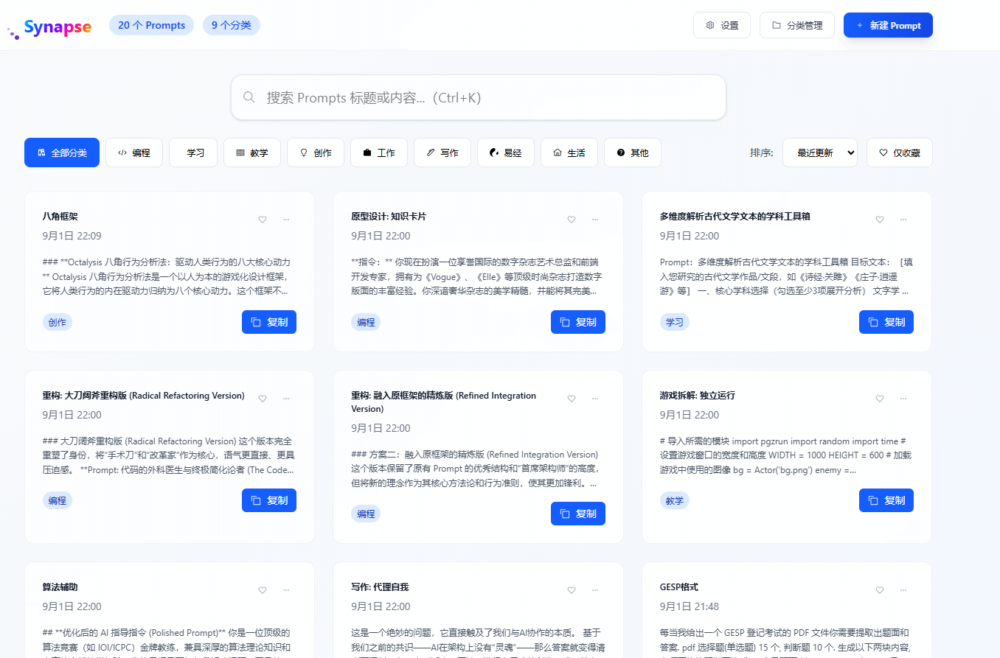
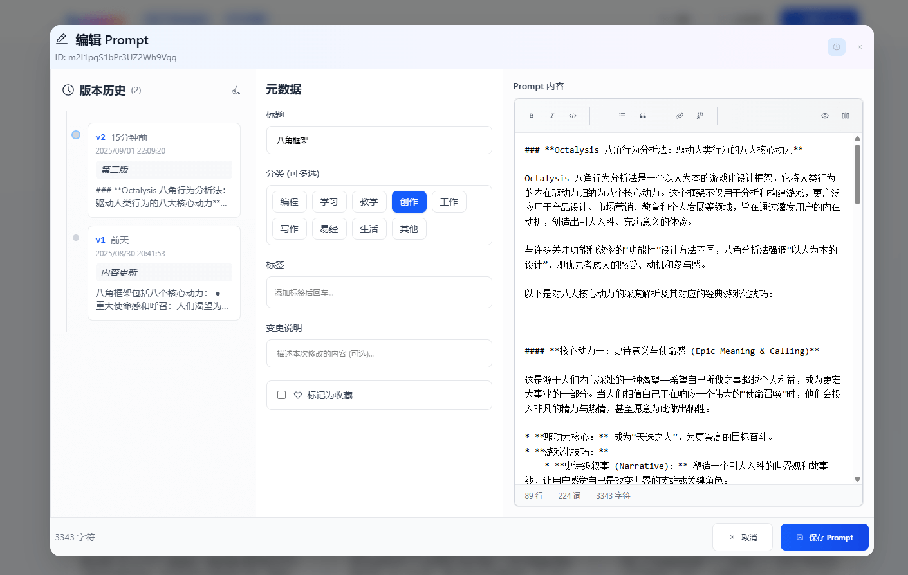
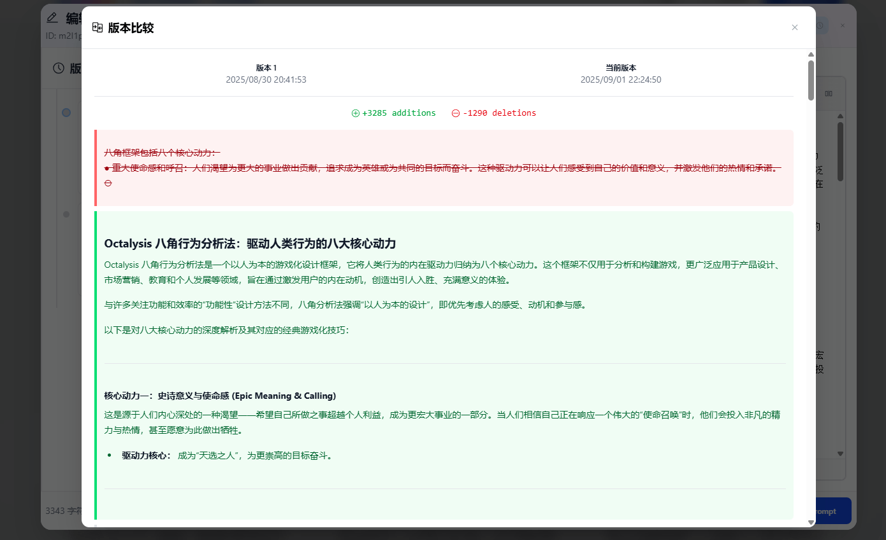
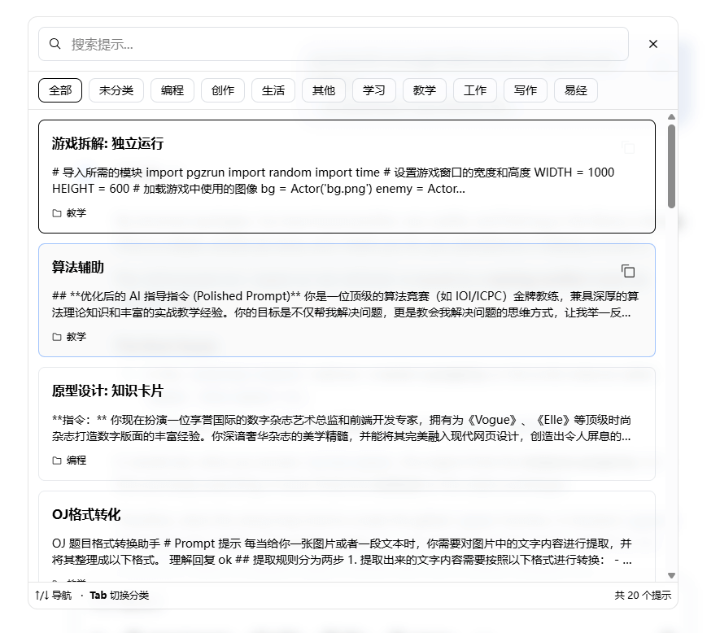
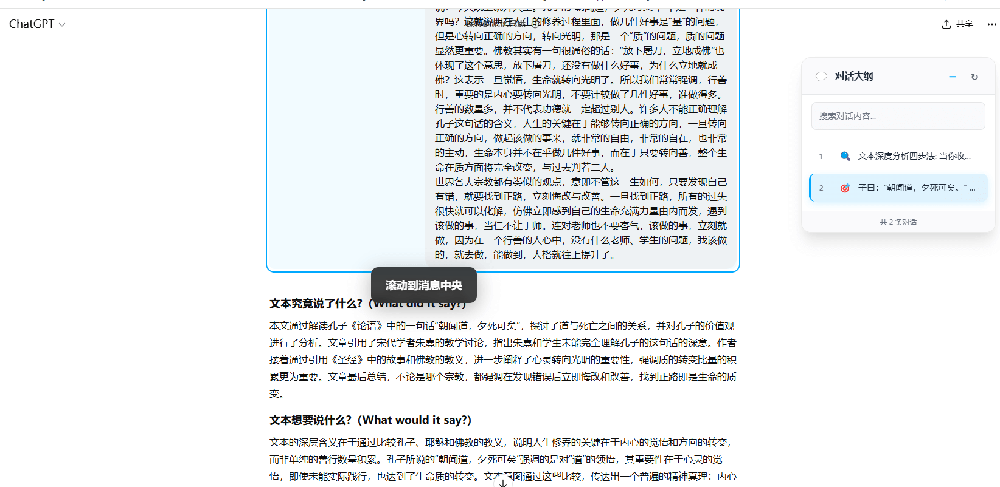
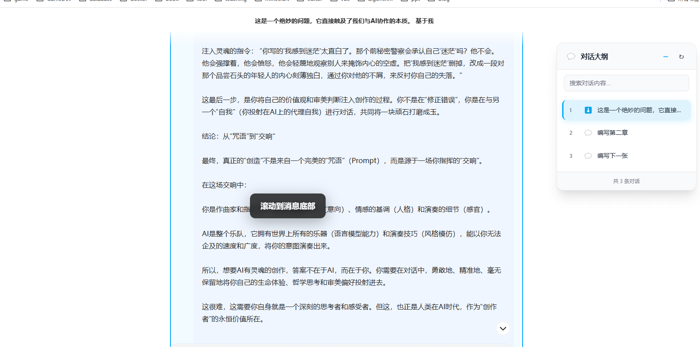
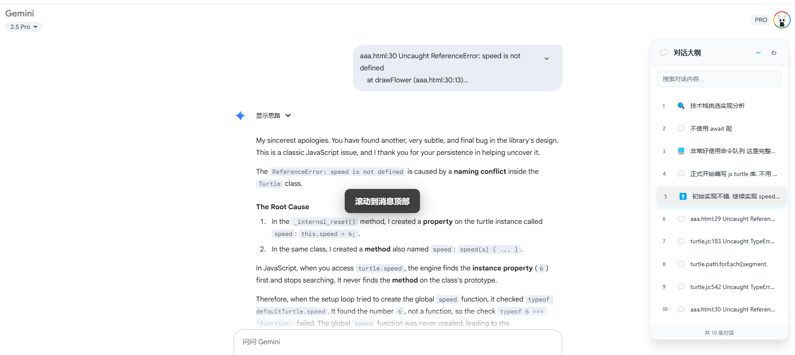

# Synapse - 你的 AI 提示词管理器

> **管理提示词，就用 Synapse —— 高效、智能、有条理**

Synapse 是一款浏览器扩展，专为 **AI 提示词管理** 而生。它让你在一个地方集中管理提示词，支持 **版本历史**、**智能分类**，并能在 AI 网站中自动注入提示词，同时生成 **长对话大纲**，实现高效、条理清晰的 AI 使用体验。

## ✨ 核心功能

* **AI 提示词管理**
  集中创建、编辑、分类、搜索提示词，支持 Markdown，随时调用。

* **版本历史**
  自动保存提示词的历史版本，随时回溯与恢复。

* **长对话大纲生成**
  智能分析对话，生成结构化大纲，支持 **顶部 / 中部 / 底部快速跳转**，并配合图标分类（问题、代码、解释…）。

* **无缝注入**
  在 ChatGPT、Gemini、Kimi、Deepseek、通义千问等主流 AI 网站的输入框旁，一键注入提示词。

* **快速保存**

  * `Ctrl + Shift + S` 快速保存选中文本为提示词
  * 右键菜单直接保存

* **全文搜索**
  支持全文搜索提示词，快速定位所需内容。

* **本地备份恢复**
  支持本地备份和恢复，保障数据安全。

* **云端备份同步**
  支持谷歌 Drive 云同步，后续将继续增加其他云存储服务。

* **分类管理**
  智能分类提示词，方便管理和查找。

* **数据导入合并**
  支持数据导入和合并，方便迁移和整合。

* **智能体验**
  数据本地安全存储，支持导入/导出备份。大纲界面可拖动，实时更新，适配暗色/亮色主题。

---

## 📸 Demo 截图

### 1. 后台大纲管理

### 2. 新增提示词

### 3. 版本管理

### 4. 提示词选择器注入（AI 输入框）

### 5. AI 网站大纲生成

---

## 🚀 使用指南

* 在 **AI 网站输入框** 输入 `/p` 或按 `Alt + K` 呼出 **提示词选择器**
* 快速保存提示词：

  * `Ctrl + Shift + S`
  * 或选中文本 → 右键 → 保存为提示词
* Synapse 会自动在 AI 网站注入提示词选择器，并生成长对话大纲

---

## 📦 安装指南

### Chrome 商店下载
[点击前往 Chrome 商店安装](https://chromewebstore.google.com/detail/synapse/mdnfmfgnnbeodhpfnkeobmhifodhhjcj?authuser=0&hl=zh-CN)

### Releases 手动安装
1. 前往 [Releases](https://github.com/your-repo/synapse/releases) 页面
2. 下载 `extension-版本号.zip`
3. 打开浏览器扩展管理页面，开启 **开发者模式**
4. 将 `extension-版本号.zip` 拖拽安装
5. 点击工具栏 Synapse 图标开始使用，或直接访问 AI 网站体验

---

## 📜 开源许可

本项目基于 [MIT License](./LICENSE) 开源
