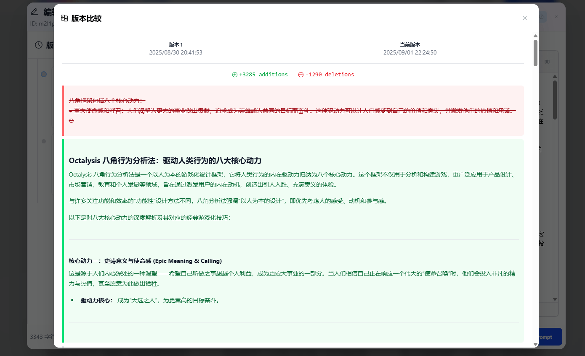

# Synapse - 你的 AI 助手工具箱

> **提示词管理 · 对话采集 · 代码片段 —— 一站式 AI 使用体验**

Synapse 是一款围绕 AI 使用场景打造的浏览器扩展，集提示词管理、对话采集、代码片段三大模块于一体。提示词支持版本追溯、全文搜索与一键注入；对话采集覆盖 ChatGPT、Claude、Gemini、DeepSeek 等 12+ 主流平台，支持实时同步与多格式导出；内置长对话大纲导航，快速定位关键内容。告别碎片化，让每一次 AI 交互都有迹可循。

## ✨ 核心功能

### 📝 提示词管理

* 集中创建、编辑、分类、搜索提示词，随时调用
* 所见即所得的 Markdown 编辑器，实时预览排版效果
* 自动保存提示词的历史版本，随时回溯与恢复
* 在 AI 网站输入框旁一键注入提示词（`/p` 或 `Alt + K` 呼出选择器）
* `Ctrl + Shift + S` 快速保存选中文本 / 右键菜单直接保存
* 全文搜索，快速定位所需内容

### 💬 对话采集与管理

* 一键采集 AI 平台对话记录，支持手动采集与实时同步两种模式
* 支持 12+ 平台：ChatGPT、Claude、Gemini、AI Studio、DeepSeek、Kimi、豆包、腾讯元宝、Grok、Copilot、MiniMax、智谱清言等
* 按平台、标签、收藏筛选，多维度排序（更新时间、创建时间、采集时间、标题、消息数）
* 对话详情查看，完整保留代码高亮、数学公式（KaTeX）、Mermaid 图表渲染
* 支持大纲导航快速跳转
* 支持导出为 JSON / Markdown / TXT / HTML / PDF 多种格式

### 🧩 代码片段管理

* 文件夹树形组织 + 标签分类，灵活管理代码片段
* 支持 30+ 种语言高亮：JavaScript、TypeScript、Python、Java、C/C++、C#、Go、Rust、Ruby、PHP、Swift、Kotlin、Dart 等
* 收藏、搜索、多维排序，快速定位常用片段
* 一键复制并自动记录使用次数

### 🔖 长对话大纲

* 智能分析对话，生成结构化大纲
* 支持顶部 / 中部 / 底部快速跳转，配合图标分类（问题、代码、解释…）
* 大纲界面可拖动，实时更新，适配暗色/亮色主题

### ☁️ 数据与同步

* 数据本地安全存储，支持导入/导出备份
* 支持 Google Drive 云同步，后续将继续增加其他云存储服务
* 数据导入合并，方便迁移和整合

---

## 📸 Demo 截图

### 提示词管理

### 提示词选择器注入（AI 输入框）

### 对话采集与管理

### AI 网站大纲生成

### 代码片段管理

---

## 🌐 支持平台

ChatGPT · Claude · Gemini · AI Studio · DeepSeek · Kimi · 豆包 · 腾讯元宝 · Grok · Copilot · MiniMax · 智谱清言 等

## 🚀 使用指南

* 在 **AI 网站输入框** 输入 `/p` 或按 `Alt + K` 呼出 **提示词选择器**
* 快速保存提示词：`Ctrl + Shift + S` 或选中文本 → 右键 → 保存为提示词
* 在 AI 网站侧边面板中一键采集当前对话，或开启实时同步
* 打开扩展后台页面管理提示词、对话记录和代码片段

---

## 📦 安装指南

### Chrome 商店下载
[点击前往 Chrome 商店安装](https://chromewebstore.google.com/detail/synapse/mdnfmfgnnbeodhpfnkeobmhifodhhjcj?authuser=0&hl=zh-CN)

### Releases 手动安装
1. 前往 [Releases](https://github.com/your-repo/synapse/releases) 页面
2. 下载 `extension-版本号.zip`
3. 打开浏览器扩展管理页面，开启 **开发者模式**
4. 将 `extension-版本号.zip` 拖拽安装
5. 点击工具栏 Synapse 图标开始使用，或直接访问 AI 网站体验

---

## 📜 开源许可

本项目基于 [MIT License](./LICENSE) 开源
