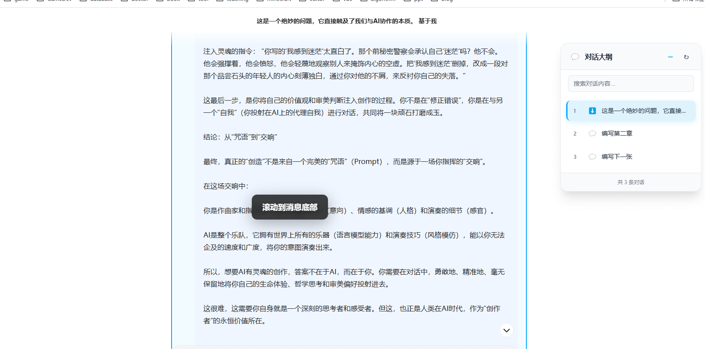

# Synapse - Deine KI-Toolbox

> **Prompt-Verwaltung · Chat-Sammlung · Code-Snippets — Alles-in-Einem KI-Erlebnis**

Synapse ist eine Browser-Erweiterung für deinen KI-Workflow — sie vereint Prompt-Verwaltung, Chat-Sammlung und Code-Snippets an einem Ort. Verwalte Prompts mit Versionshistorie, Volltextsuche und Ein-Klick-Injektion in KI-Websites. Sammle Unterhaltungen von 12+ Plattformen wie ChatGPT, Claude, Gemini und DeepSeek mit Echtzeit-Synchronisierung und Multi-Format-Export. Navigiere mühelos durch lange Dialoge mit automatisch generierten Gliederungen.

## ✨ Kernfunktionen

### 📝 Prompt-Verwaltung

* Prompts zentral erstellen, bearbeiten, kategorisieren und durchsuchen
* WYSIWYG Markdown-Editor mit Echtzeit-Vorschau
* Automatische Versionierung deiner Prompts mit Wiederherstellungsmöglichkeit
* Ein-Klick-Injektion neben KI-Website-Eingabefeldern (`Alt + K`)
* `Strg + Umschalt + S` zum schnellen Speichern / Rechtsklick-Kontextmenü
* Volltextsuche für schnellen Zugriff

### 💬 Chat-Sammlung & Verwaltung

* Ein-Klick-Sammlung von KI-Plattform-Unterhaltungen mit manueller und Echtzeit-Synchronisierung
* 12+ Plattformen: ChatGPT, Claude, Gemini, AI Studio, DeepSeek, Kimi, Doubao, Tencent Yuanbao, Grok, Copilot, MiniMax, Zhipu ChatGLM u.v.m.
* Filtern nach Plattform, Tags und Favoriten; mehrdimensionale Sortierung
* Detailansicht mit Code-Highlighting, KaTeX-Formeln und Mermaid-Diagrammen
* Gliederungsnavigation zum schnellen Springen
* Export als JSON / Markdown / TXT / HTML / PDF

### 🧩 Code-Snippet-Verwaltung

* Ordnerstruktur + Tag-Kategorisierung für flexible Verwaltung
* Syntax-Highlighting für 30+ Sprachen
* Favoriten, Suche und mehrdimensionale Sortierung
* Ein-Klick-Kopieren mit automatischer Nutzungsverfolgung

### 🔖 Lange Gesprächsgliederung

* Intelligente Analyse von Unterhaltungen zur Erstellung strukturierter Gliederungen
* Schnellnavigation nach oben, Mitte oder unten mit Icon-Kategorisierung
* Ziehbare Gliederungsoberfläche, Echtzeit-Updates, Anpassung an dunkle/helle Themes

### ☁️ Daten & Synchronisierung

* Lokale Datenspeicherung mit Import/Export-Backup
* Google Drive Cloud-Synchronisierung
* Datenimport und -zusammenführung für einfache Migration

---

## 📸 Demo-Screenshots

### Prompt-Verwaltung

### Prompt-Selektor-Injektion (KI-Eingabefeld)

### Chat-Sammlung & Verwaltung

### KI-Website-Gliederung

### Code-Snippet-Verwaltung

---

## 🌐 Unterstützte Plattformen

ChatGPT · Claude · Gemini · AI Studio · DeepSeek · Kimi · Doubao · Tencent Yuanbao · Grok · Copilot · MiniMax · Zhipu ChatGLM u.v.m.

## 🚀 Nutzungsanleitung

* Im **KI-Website-Eingabefeld** `/p` eingeben oder `Alt + K` drücken für den **Prompt-Selektor**
* Schnell speichern: `Strg + Umschalt + S` oder Text markieren → Rechtsklick → Als Prompt speichern
* Im Seitenpanel der KI-Website die aktuelle Unterhaltung mit einem Klick sammeln
* Das Erweiterungs-Dashboard öffnen, um Prompts, Chats und Code-Snippets zu verwalten

---

## 📦 Installationsanleitung

### Chrome Web Store
[Hier im Chrome Web Store installieren](https://chromewebstore.google.com/detail/synapse/mdnfmfgnnbeodhpfnkeobmhifodhhjcj?authuser=0&hl=de)

### Manuelle Installation
1. Zur [Releases](https://github.com/yviscool/synapse/releases)-Seite gehen
2. `extension-vX.X.X.zip` herunterladen
3. Browser-Erweiterungsverwaltung öffnen und **Entwicklermodus** aktivieren
4. Die ZIP-Datei per Drag & Drop installieren
5. Auf das Synapse-Symbol in der Symbolleiste klicken

---

## 📜 Lizenz

Dieses Projekt steht unter der [MIT License](../LICENSE)
