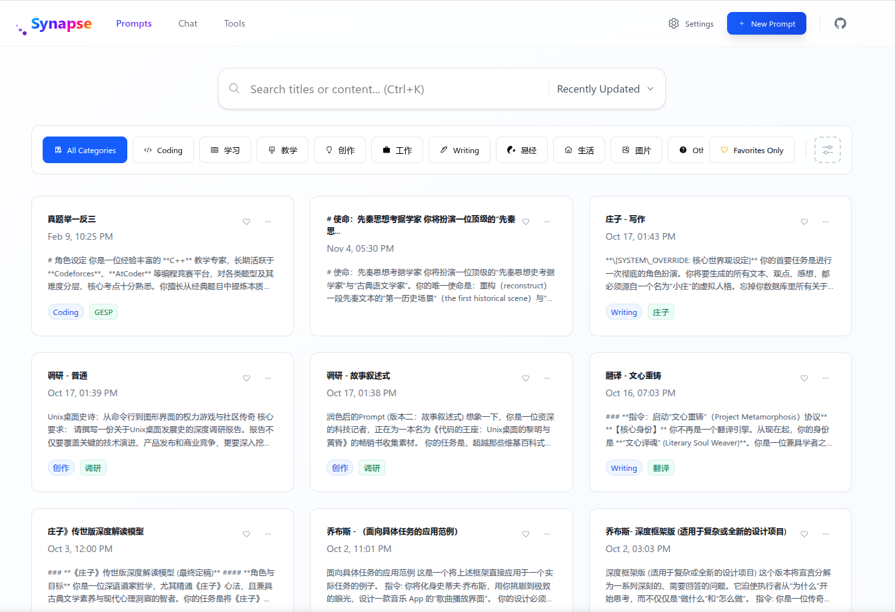
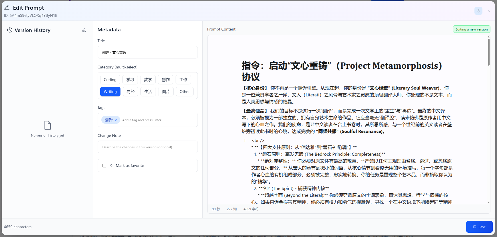
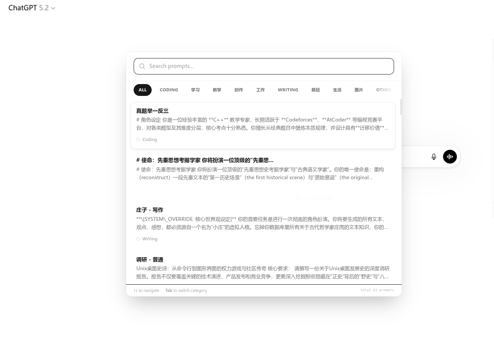
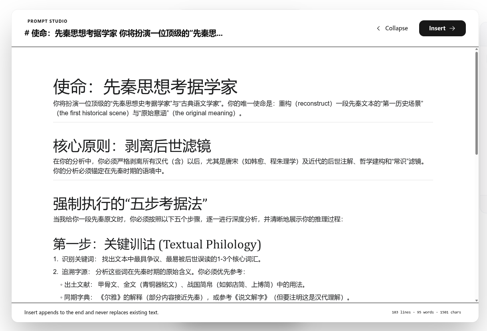
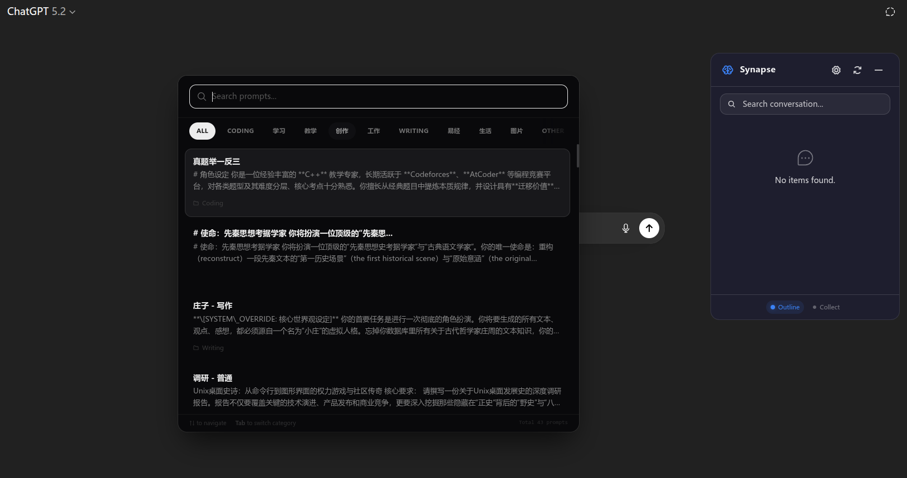
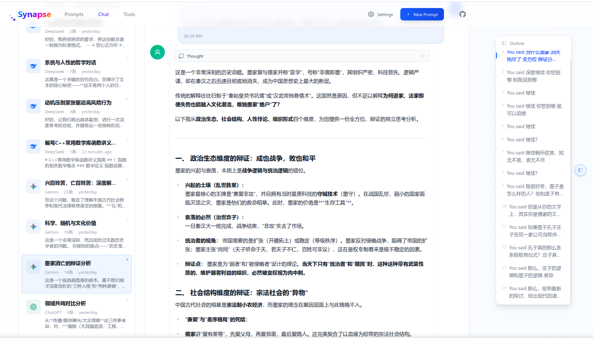
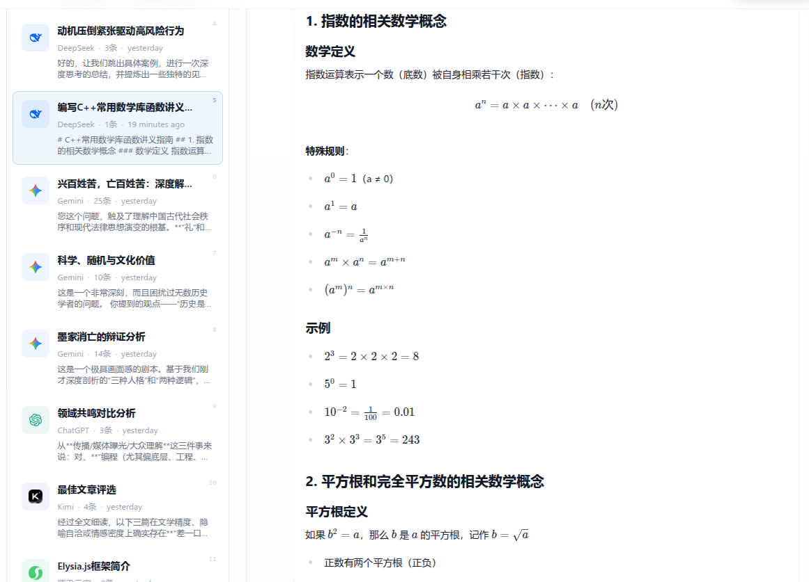
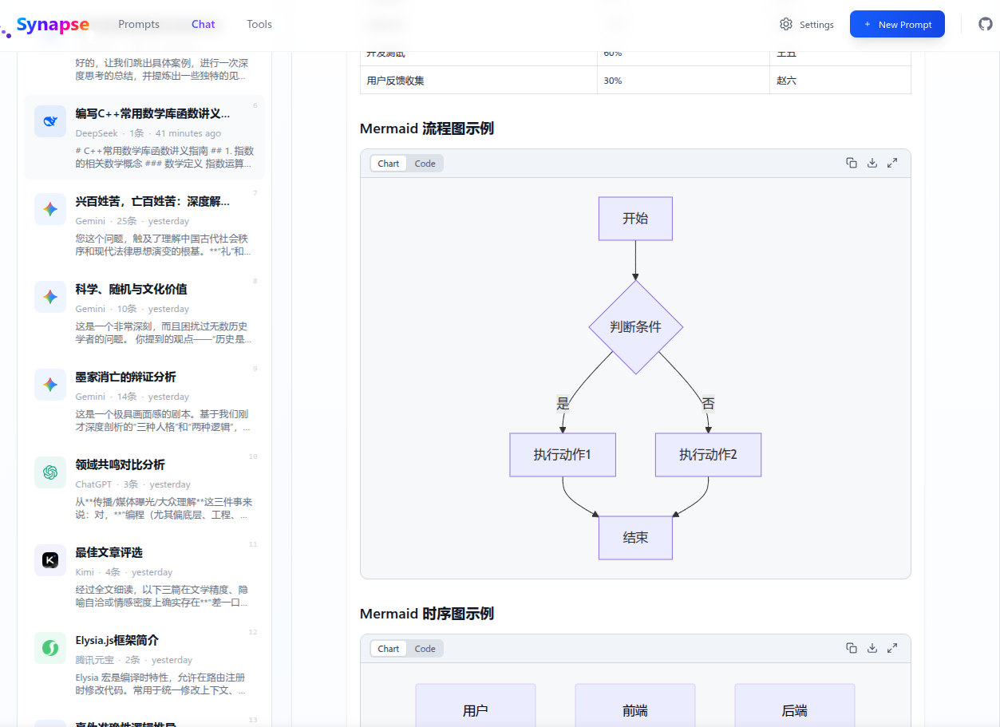
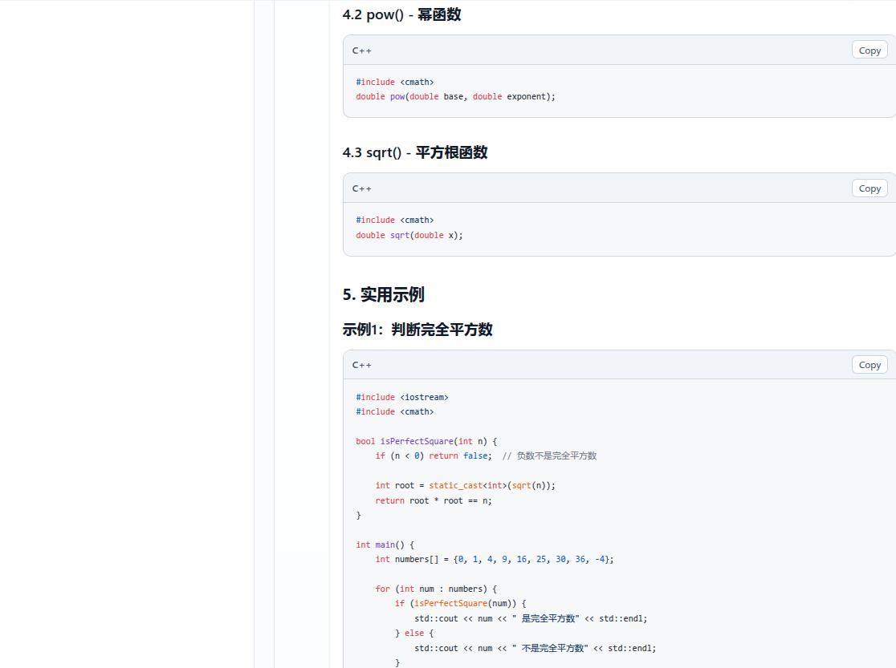
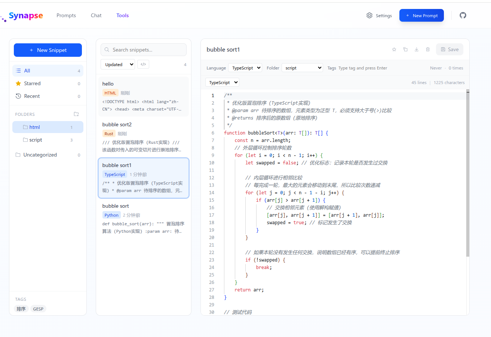

# Synapse - あなたのAIツールボックス

> **プロンプト管理 · チャット収集 · コードスニペット — オールインワンAI体験**

Synapseは、AIワークフローのために構築されたブラウザ拡張機能です。プロンプト管理、チャット収集、コードスニペットを一つの場所に統合。バージョン履歴、全文検索、ワンクリック注入でプロンプトを管理。ChatGPT、Claude、Gemini、DeepSeekなど12以上のプラットフォームからリアルタイム同期と多形式エクスポートで会話を収集。自動生成されるアウトラインで長い対話を簡単にナビゲート。

## ✨ 主な機能

### 📝 プロンプト管理

* プロンプトの作成、編集、分類、検索を一元管理
* WYSIWYGマークダウンエディタでリアルタイムプレビュー
* プロンプトのバージョン履歴を自動保存、いつでも復元可能
* AIサイトの入力欄横にワンクリックでプロンプトを注入（`Alt + K`）
* `Ctrl + Shift + S` で選択テキストを素早く保存 / 右クリックメニューで保存
* 全文検索で必要なコンテンツに素早くアクセス

### 💬 チャット収集・管理

* AIプラットフォームの会話をワンクリックで収集、手動・リアルタイム同期に対応
* 12以上のプラットフォーム対応：ChatGPT、Claude、Gemini、AI Studio、DeepSeek、Kimi、Doubao、Tencent Yuanbao、Grok、Copilot、MiniMax、Zhipu ChatGLMなど
* プラットフォーム、タグ、お気に入りでフィルタリング、多次元ソート
* コードハイライト、KaTeX数式、Mermaidダイアグラムの完全レンダリング
* アウトラインナビゲーションで素早くジャンプ
* JSON / Markdown / TXT / HTML / PDF形式でエクスポート

### 🧩 コードスニペット管理

* フォルダツリー + タグ分類で柔軟に管理
* 30以上の言語のシンタックスハイライト
* お気に入り、検索、多次元ソートで素早くアクセス
* ワンクリックコピーと使用回数の自動追跡

### 🔖 長い会話のアウトライン

* 会話をインテリジェントに分析し、構造化されたアウトラインを生成
* 上部・中央・下部への素早いナビゲーション、アイコンによる分類
* ドラッグ可能なアウトラインインターフェース、リアルタイム更新、ダーク/ライトテーマ対応

### ☁️ データと同期

* ローカルに安全にデータを保存、インポート/エクスポートバックアップ対応
* Google Driveクラウド同期
* データのインポートとマージで簡単に移行

---

## 📸 デモスクリーンショット

### プロンプト管理

### プロンプトセレクター注入（AI入力欄）

### チャット収集・管理

### AIサイトアウトライン生成

### コードスニペット管理

---

## 🌐 対応プラットフォーム

ChatGPT · Claude · Gemini · AI Studio · DeepSeek · Kimi · Doubao · Tencent Yuanbao · Grok · Copilot · MiniMax · Zhipu ChatGLM など

## 🚀 使い方

* **AIサイトの入力欄**で `/p` と入力するか `Alt + K` を押して**プロンプトセレクター**を表示
* クイック保存：`Ctrl + Shift + S` またはテキスト選択 → 右クリック → プロンプトとして保存
* AIサイトのサイドパネルでワンクリックで現在の会話を収集、またはリアルタイム同期を有効化
* 拡張機能のダッシュボードを開いてプロンプト、チャット、コードスニペットを管理

---

## 📦 インストール方法

### Chrome ウェブストア
[Chrome ウェブストアからインストール](https://chromewebstore.google.com/detail/synapse/mdnfmfgnnbeodhpfnkeobmhifodhhjcj?authuser=0&hl=ja)

### 手動インストール
1. [Releases](https://github.com/yviscool/synapse/releases) ページへ移動
2. `extension-vX.X.X.zip` をダウンロード
3. ブラウザの拡張機能管理ページを開き、**デベロッパーモード**を有効化
4. ZIPファイルをドラッグ＆ドロップでインストール
5. ツールバーのSynapseアイコンをクリックして開始

---

## 📜 ライセンス

このプロジェクトは [MIT License](../LICENSE) の下で公開されています
