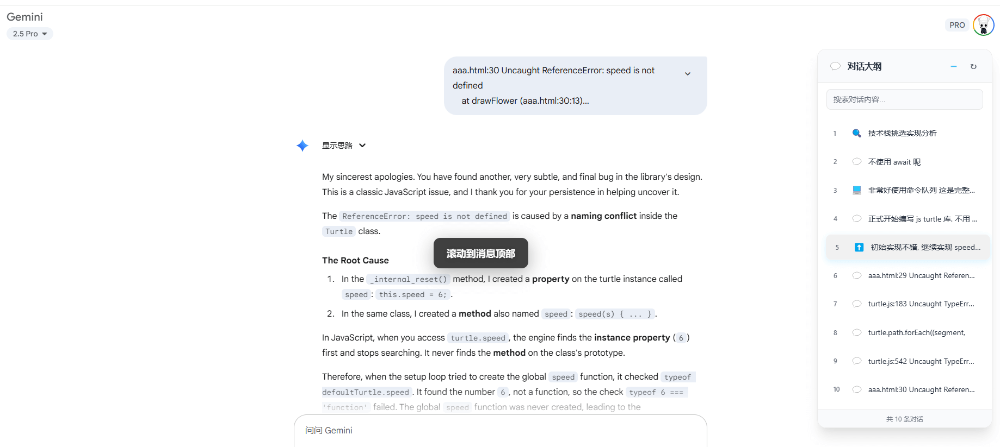

# Synapse - 당신의 AI 도구 상자

> **프롬프트 관리 · 대화 수집 · 코드 스니펫 — 올인원 AI 경험**

Synapse는 AI 워크플로우를 위해 만들어진 브라우저 확장 프로그램입니다. 프롬프트 관리, 대화 수집, 코드 스니펫을 한 곳에서 통합 관리합니다. 버전 기록, 전문 검색, 원클릭 주입으로 프롬프트를 관리하고, ChatGPT, Claude, Gemini, DeepSeek 등 12개 이상의 플랫폼에서 실시간 동기화와 다양한 형식의 내보내기로 대화를 수집합니다. 자동 생성되는 개요로 긴 대화를 쉽게 탐색하세요.

## ✨ 핵심 기능

### 📝 프롬프트 관리

* 프롬프트 생성, 편집, 분류, 검색을 한 곳에서
* WYSIWYG 마크다운 에디터로 실시간 미리보기
* 프롬프트 버전 기록 자동 저장, 언제든 복원 가능
* AI 사이트 입력란 옆에 원클릭으로 프롬프트 주입 (`Alt + K`)
* `Ctrl + Shift + S`로 선택 텍스트 빠른 저장 / 우클릭 메뉴로 저장
* 전문 검색으로 필요한 콘텐츠에 빠르게 접근

### 💬 대화 수집 및 관리

* AI 플랫폼 대화를 원클릭으로 수집, 수동 및 실시간 동기화 지원
* 12개 이상 플랫폼 지원: ChatGPT, Claude, Gemini, AI Studio, DeepSeek, Kimi, Doubao, Tencent Yuanbao, Grok, Copilot, MiniMax, Zhipu ChatGLM 등
* 플랫폼, 태그, 즐겨찾기로 필터링, 다차원 정렬
* 코드 하이라이팅, KaTeX 수식, Mermaid 다이어그램 완벽 렌더링
* 개요 내비게이션으로 빠른 이동
* JSON / Markdown / TXT / HTML / PDF 형식으로 내보내기

### 🧩 코드 스니펫 관리

* 폴더 트리 + 태그 분류로 유연한 관리
* 30개 이상 언어의 구문 강조
* 즐겨찾기, 검색, 다차원 정렬로 빠른 접근
* 원클릭 복사 및 사용 횟수 자동 추적

### 🔖 긴 대화 개요

* 대화를 지능적으로 분석하여 구조화된 개요 생성
* 상단, 중간, 하단으로 빠른 이동, 아이콘 기반 분류
* 드래그 가능한 개요 인터페이스, 실시간 업데이트, 다크/라이트 테마 지원

### ☁️ 데이터 및 동기화

* 로컬에 안전하게 데이터 저장, 가져오기/내보내기 백업 지원
* Google Drive 클라우드 동기화
* 데이터 가져오기 및 병합으로 쉬운 마이그레이션

---

## 📸 데모 스크린샷

### 프롬프트 관리

### 프롬프트 선택기 주입 (AI 입력란)

### 대화 수집 및 관리

### AI 사이트 개요 생성

### 코드 스니펫 관리

---

## 🌐 지원 플랫폼

ChatGPT · Claude · Gemini · AI Studio · DeepSeek · Kimi · Doubao · Tencent Yuanbao · Grok · Copilot · MiniMax · Zhipu ChatGLM 등

## 🚀 사용 가이드

* **AI 사이트 입력란**에서 `/p` 입력 또는 `Alt + K`를 눌러 **프롬프트 선택기** 표시
* 빠른 저장: `Ctrl + Shift + S` 또는 텍스트 선택 → 우클릭 → 프롬프트로 저장
* AI 사이트 사이드 패널에서 원클릭으로 현재 대화 수집 또는 실시간 동기화 활성화
* 확장 프로그램 대시보드를 열어 프롬프트, 대화, 코드 스니펫 관리

---

## 📦 설치 가이드

### Chrome 웹 스토어
[Chrome 웹 스토어에서 설치](https://chromewebstore.google.com/detail/synapse/mdnfmfgnnbeodhpfnkeobmhifodhhjcj?authuser=0&hl=ko)

### 수동 설치
1. [Releases](https://github.com/yviscool/synapse/releases) 페이지로 이동
2. `extension-vX.X.X.zip` 다운로드
3. 브라우저 확장 프로그램 관리 페이지를 열고 **개발자 모드** 활성화
4. ZIP 파일을 드래그 앤 드롭으로 설치
5. 도구 모음의 Synapse 아이콘을 클릭하여 시작

---

## 📜 라이선스

이 프로젝트는 [MIT License](../LICENSE) 하에 공개되어 있습니다
