# Synapse - AI araç kutunuz

> **Prompt Yönetimi · Sohbet Toplama · Kod Parçacıkları — Hepsi bir arada AI deneyimi**

Synapse, AI iş akışınız için geliştirilmiş bir tarayıcı uzantısıdır. Prompt yönetimi, sohbet toplama ve kod parçacıklarını tek yerde birleştirir. Sürüm geçmişi, tam metin arama ve tek tıkla ekleme özellikleriyle prompt'ları yönetin. ChatGPT, Claude, Gemini, DeepSeek gibi 12+ platformdan konuşmaları toplayın; gerçek zamanlı senkronizasyon ve çoklu format dışa aktarma kullanın.

## ✨ Temel özellikler

### 📝 Prompt yönetimi

* Prompt oluşturma, düzenleme, kategorileme ve arama
* Gerçek zamanlı önizlemeli WYSIWYG Markdown editörü
* Otomatik sürüm geçmişi ve geri yükleme
* AI giriş kutusu yanında tek tıkla prompt ekleme (`Alt + K`)
* Seçili metni hızlı kaydetmek için `Ctrl + Shift + S`
* Tam metin arama

### 💬 Sohbet toplama ve yönetimi

* Tek tıkla toplama, manuel veya gerçek zamanlı mod
* 12+ platform desteği
* Platform, etiket ve favori filtreleri
* Kod vurgulama, KaTeX ve Mermaid destekli detay görünümü
* Uzun konuşmalar için taslak navigasyonu
* JSON / Markdown / TXT / HTML / PDF dışa aktarma

### 🧩 Kod parçacığı yönetimi

* Klasör ağacı ve etiket tabanlı düzen
* 30+ dil için sözdizimi vurgulama
* Favori, arama ve çok boyutlu sıralama
* Tek tıkla kopyalama ve kullanım takibi

### 🔖 Uzun konuşma taslağı

* Akıllı analiz ile otomatik taslak üretimi
* Üst, orta ve alt bölümlere hızlı geçiş
* Sürüklenebilir panel ve gerçek zamanlı güncelleme

### ☁️ Veri ve senkronizasyon

* Yerel saklama, içe/dışa aktarma yedekleri
* Google Drive bulut senkronizasyonu
* Kolay taşıma için veri içe aktarma ve birleştirme

---

## 📸 Demo ekran görüntüleri

### Prompt yönetimi

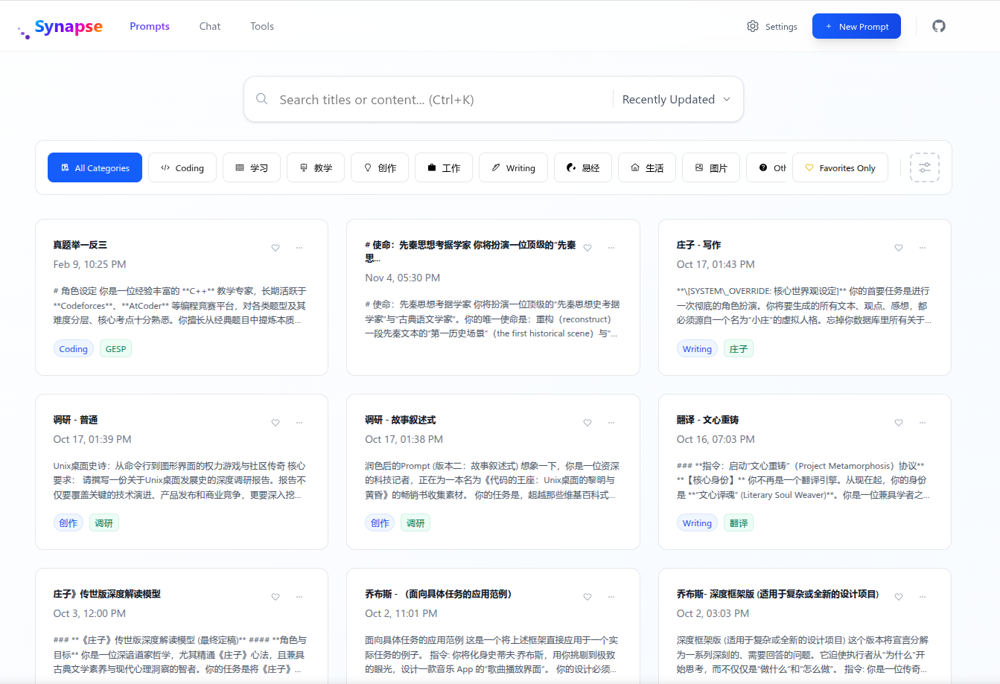
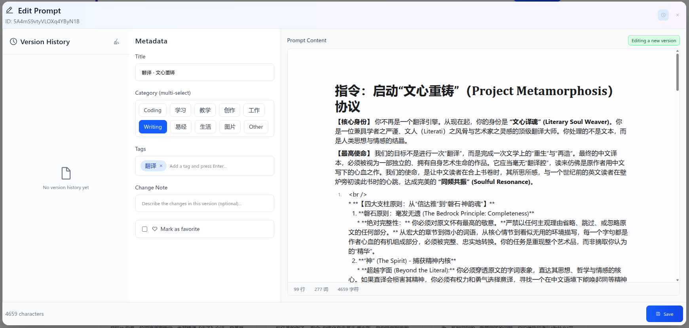
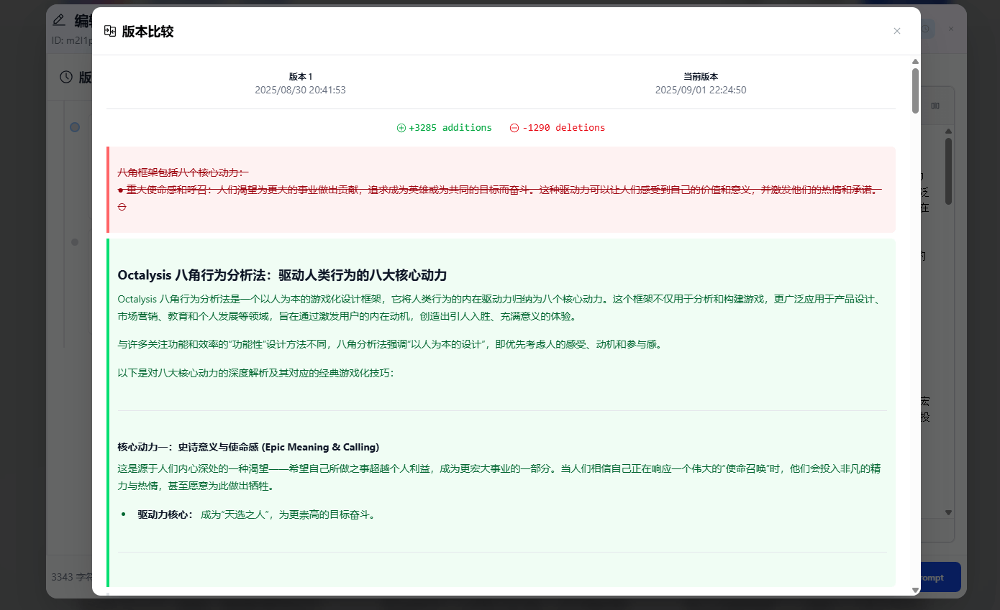

### Prompt seçici ekleme

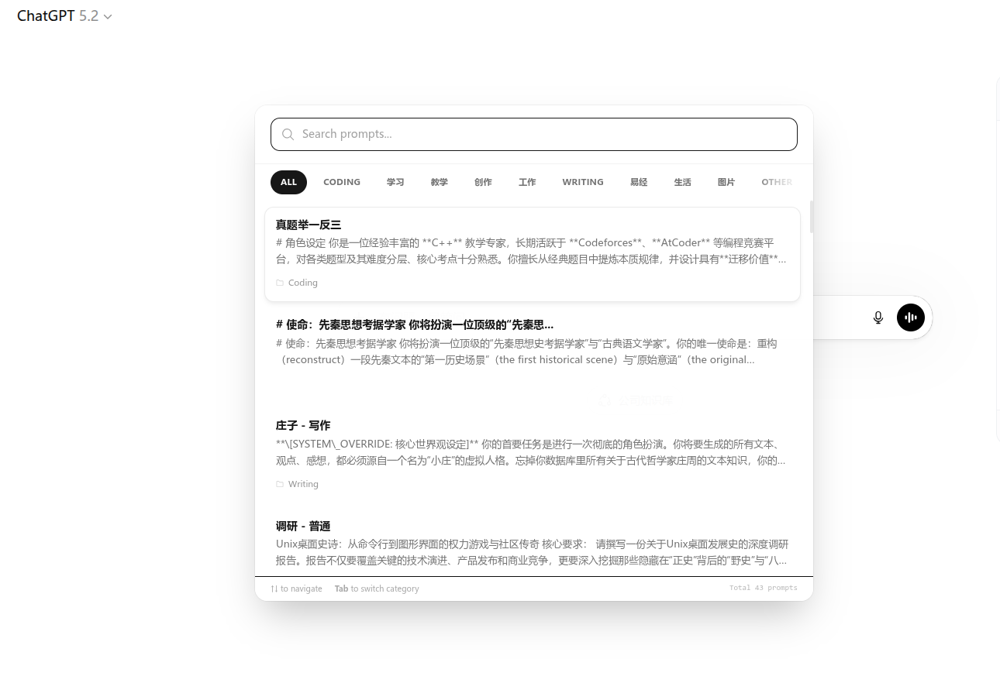
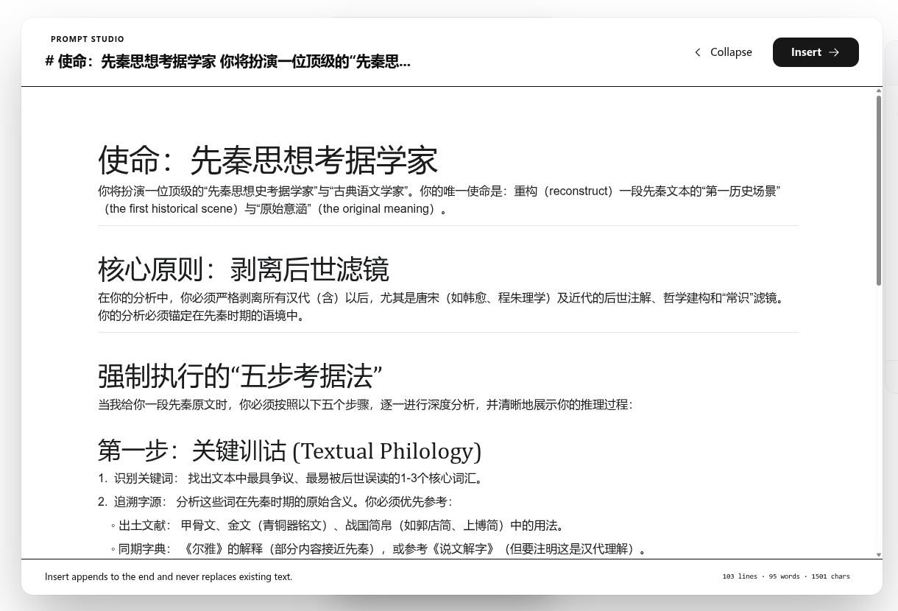
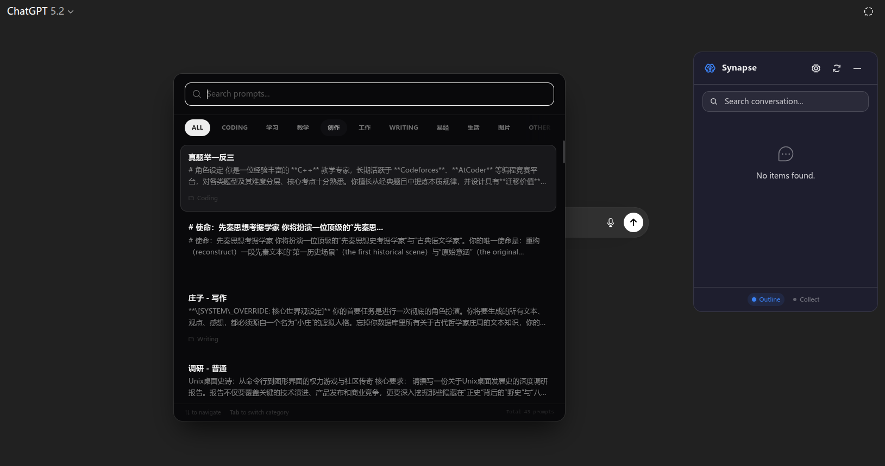

### Sohbet toplama ve yönetimi

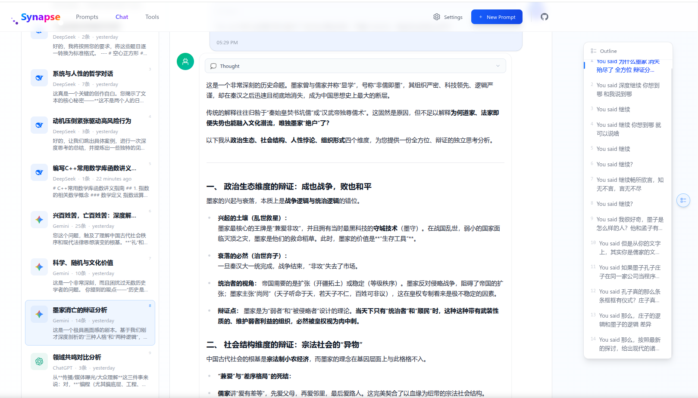
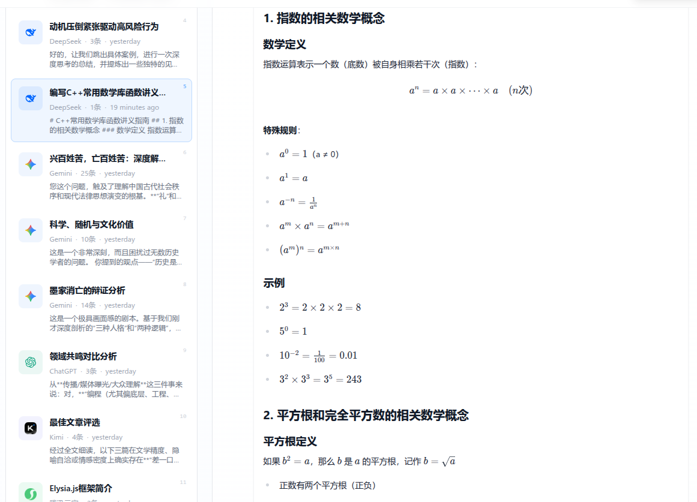
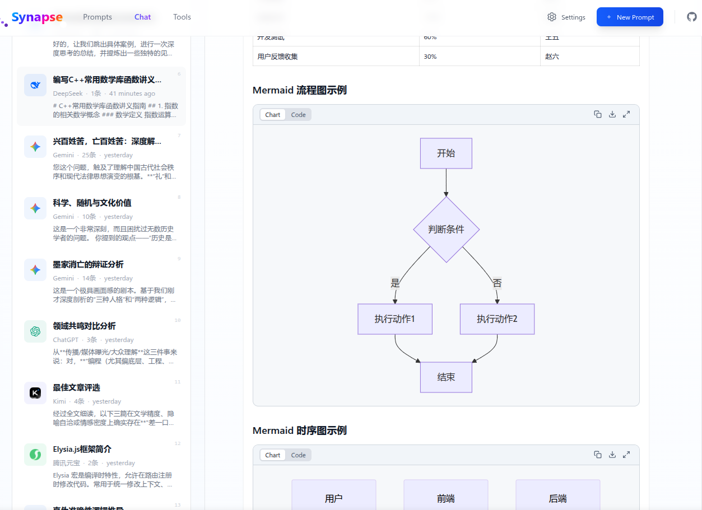
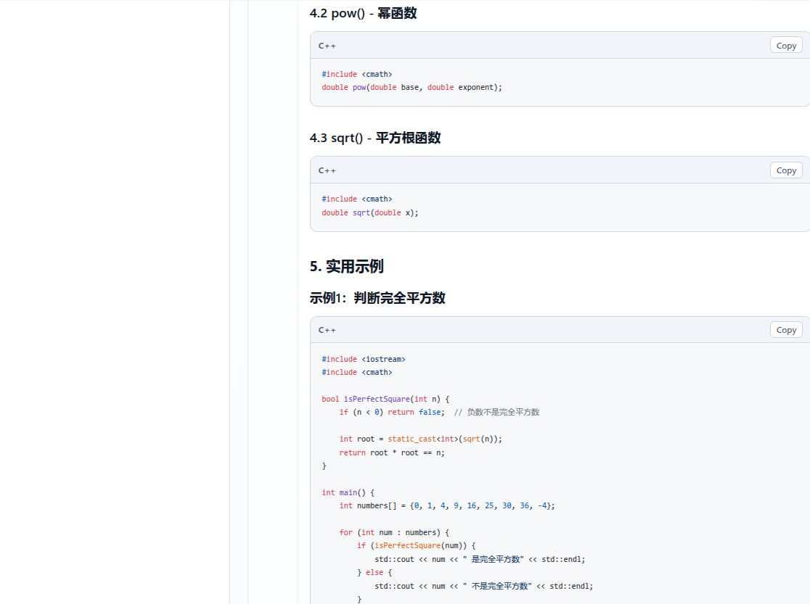

### AI sitelerinde taslak üretimi

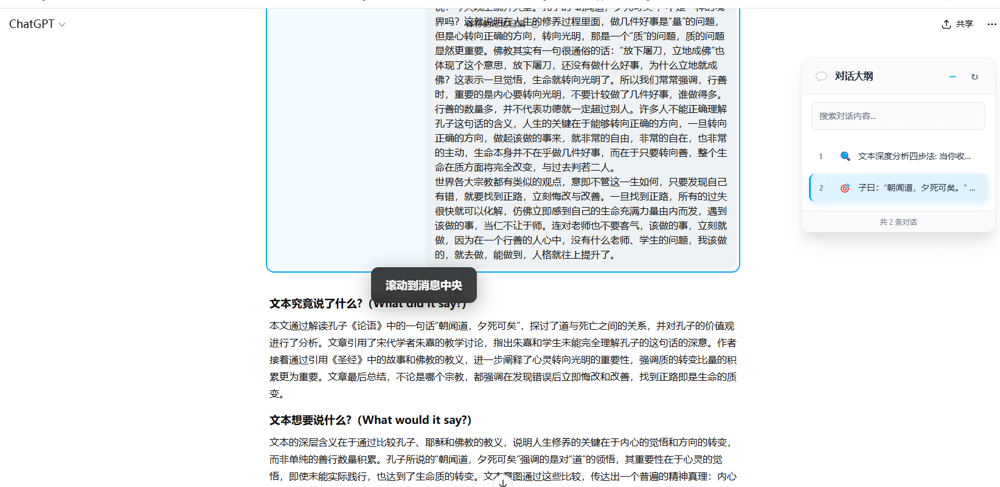
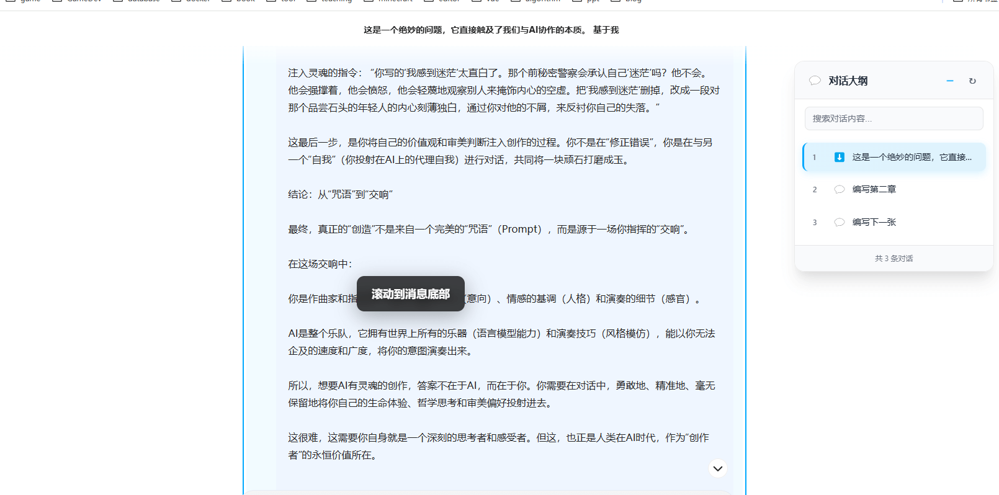
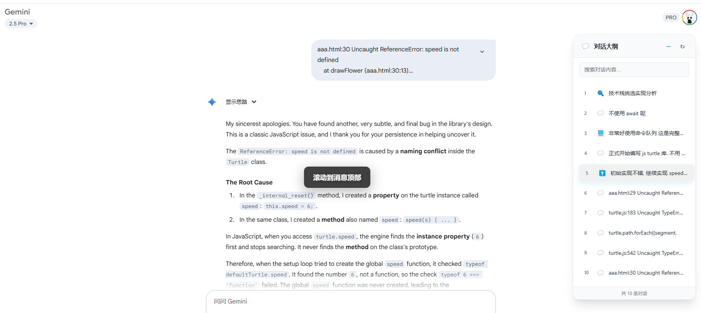

### Kod parçacığı yönetimi

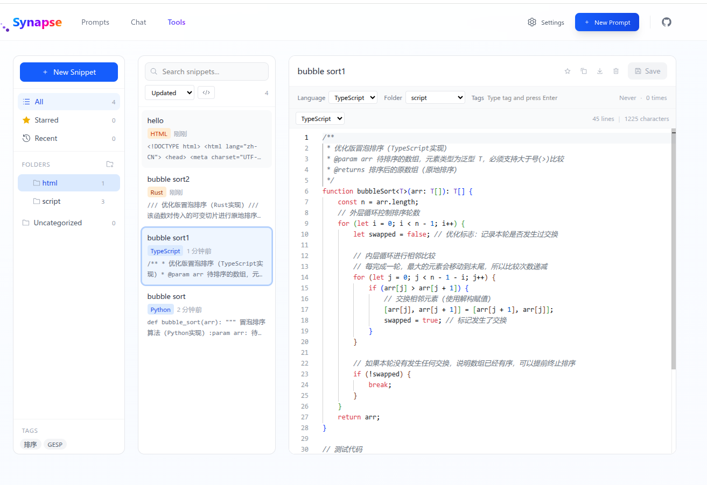
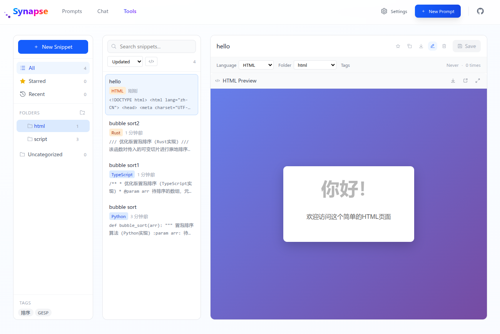

---

## 🌐 Desteklenen platformlar

ChatGPT · Claude · Gemini · AI Studio · DeepSeek · Kimi · Doubao · Tencent Yuanbao · Grok · Copilot · MiniMax · Zhipu ChatGLM ve daha fazlası

## 🚀 Kullanım rehberi

* AI giriş kutusunda `/p` yazın veya `Alt + K` tuşlayın
* `Ctrl + Shift + S` ile hızlı kaydedin veya sağ tık menüsünü kullanın
* Yan panelden konuşmaları toplayın ya da gerçek zamanlı senkronizasyonu açın
* Uzantı panelinde prompt, sohbet ve snippet'leri yönetin

---

## 📦 Kurulum

### Chrome Web Store
[Chrome Web Store'dan yükle](https://chromewebstore.google.com/detail/synapse/mdnfmfgnnbeodhpfnkeobmhifodhhjcj?authuser=0&hl=tr)

### Microsoft Edge Add-ons
[Microsoft Edge Add-ons'dan yükle](https://microsoftedge.microsoft.com/addons/detail/foicpmidihacnocjmdbkjanbjncckoaa)

### Manuel kurulum
1. [Releases](https://github.com/yviscool/synapse/releases) sayfasına gidin
2. `extension-vX.X.X.zip` dosyasını indirin
3. Eklentiler sayfasında **Developer mode** açın
4. ZIP dosyasını sürükleyip bırakın
5. Başlamak için Synapse simgesine tıklayın

---

## 📜 Lisans

Bu proje [MIT License](../LICENSE) ile lisanslanmıştır
